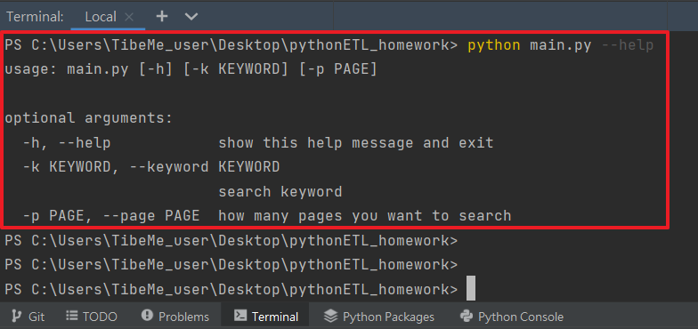
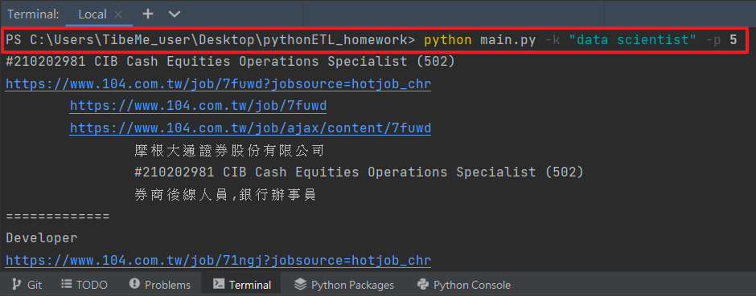
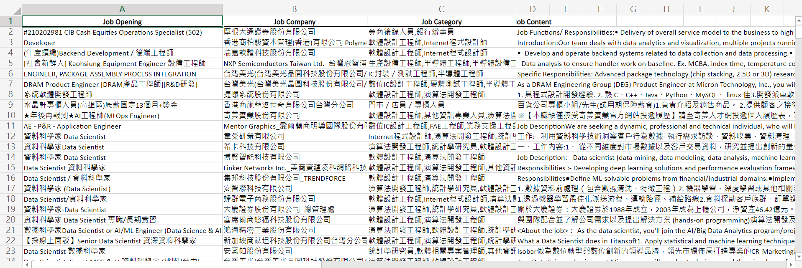

# pythonETL_homework

104人力銀行 
1. Packages:
   1. requests
   2. bs4
   3. time
   4. json
   5. pandas
   6. xlsxwriter(for excel)
   7. argparse
2. HTTP Method: GET
3. URL: https://www.104.com.tw/jobs/search/
4. Parameter:
   1. ro=0
   2. kwop=7
   3. keyword=<user_input>(with default)
   4. expansionType=area,spec,com,job,wf,wktm
   5. order=12
   6. asc=0
   7. page=<user_input>(with default)
   8. mode=s
   9. jobsource=2018indexpoc
   10. langFlag=0
5. JS render solution:
   1. url: https://www.104.com.tw/job/ajax/content/<jobID>
   2. headers: { "Referer": "https://www.104.com.tw/job/<jobID>" }

---------------------------------

步驟1 
Input '--help' to see parameters 

 
 
步驟2 
Input parameters '-k/--keyword' and '-p/--page' 

 
 
步驟3 
Save to CSV/XLSX 
